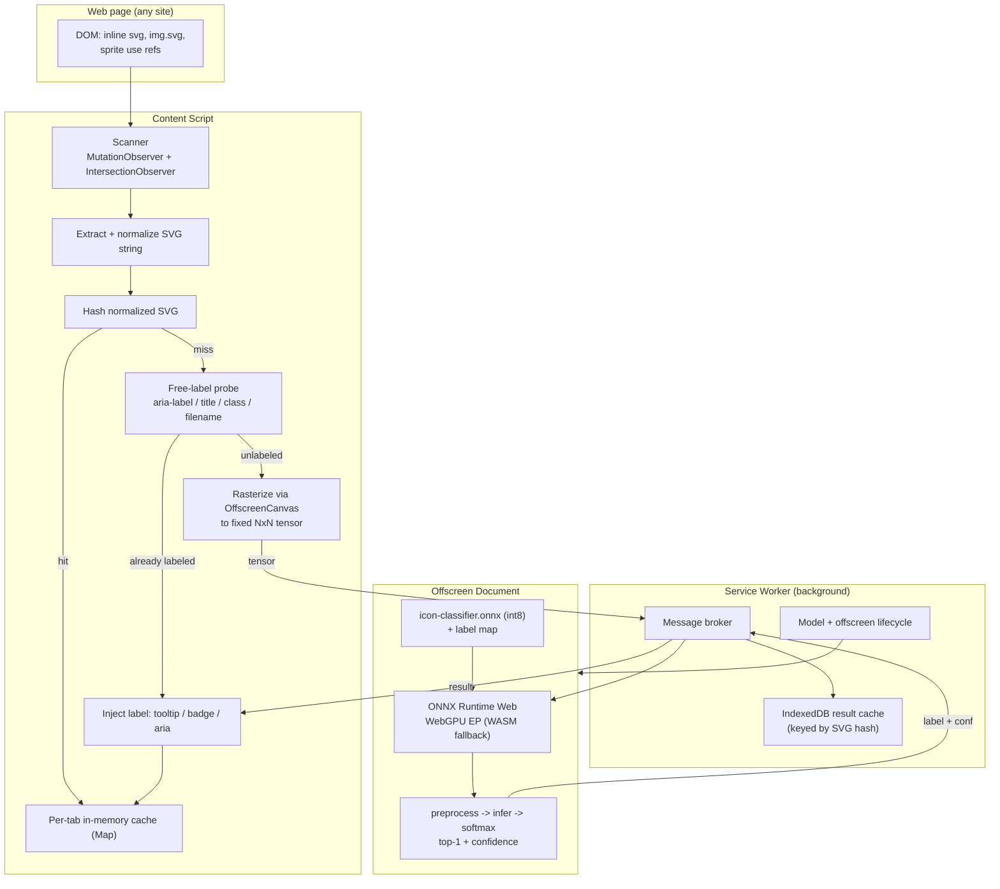
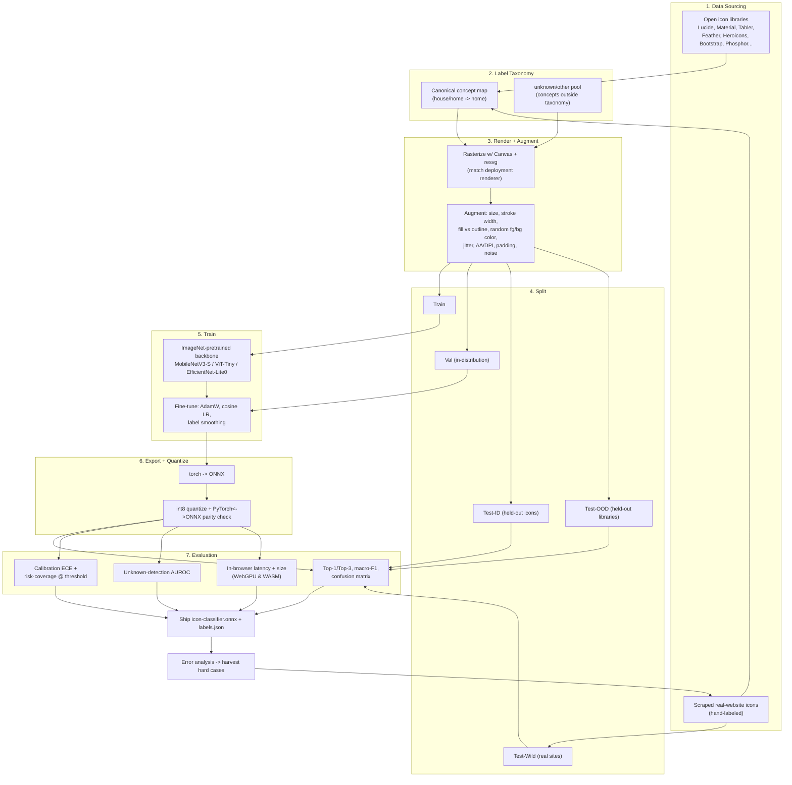

# Icon Live-Labeling Chrome Extension — Technical Plan

**Status:** Proposal / pre-implementation
**Approach:** On-device, tiny image classifier (closed label set) running in-browser via ONNX Runtime Web + WebGPU.

---

## 1. Goal

A Manifest V3 Chrome extension that detects icons on any web page and overlays a human-readable label (e.g. a house glyph → `home`, a curved arrow → `return`). All inference runs **locally** in the browser — no network calls, no server, images never leave the device.

The model is a small (<50M param, int8-quantized) image classifier fine-tuned on rendered icons, exported to ONNX. The extension rasterizes each on-page icon to a fixed-size tensor and classifies it.

## 2. Scope

**In scope (v1)**
- Inline `<svg>` elements.
- `` whose source is an SVG (`*.svg`, `data:image/svg+xml`).
- SVG sprite references (`<use href="#id">` / `<use xlink:href>`).
- Closed taxonomy of N canonical icon concepts + an `unknown` fallback gated by a confidence threshold.

**Deferred / non-goals (v1)**
- Icon fonts (Font Awesome ligatures/glyphs, Material Icons font) — these are font glyphs, not SVG nodes; flag for a phase-2 extraction path.
- Raster icons (PNG/sprites in a single bitmap).
- CSS `background-image: url(...svg)` — feasible but adds an extraction path; mark as phase-2 unless cheap.
- Open-vocabulary / free-text description of arbitrary novel icons (that needs a VLM — out of scope for the classifier approach).

## 3. Why the classifier approach

The task is narrow (visually simple monochrome glyphs) with a low-entropy output (a short label from a known set). That is the ideal shape for a tiny classifier: ~15–30 MB int8 ONNX, single-digit-ms inference, genuinely "live" across a whole page. A generative VLM is unnecessary unless open-vocabulary description is required.

---

## 4. Extension Architecture

### 4.1 Runtime data flow



### 4.2 The MV3 constraint that shapes everything

Service workers in MV3 **cannot access WebGPU or WASM**. Therefore inference lives in an **offscreen document** (`chrome.offscreen` API), which is a hidden DOM page where WebGPU/WASM/Canvas are available. The service worker only brokers messages and owns the offscreen-document lifecycle. This is the single most important architectural decision; everything else is conventional.

### 4.3 Project skeleton

```
icon-labeler/
├─ manifest.json
├─ package.json
├─ tsconfig.json
├─ vite.config.ts                 # build (CRXJS or equivalent) — implementer's choice
├─ public/
│  └─ models/
│     ├─ icon-classifier.onnx     # int8 quantized, shipped with the extension
│     └─ labels.json              # index -> canonical label + metadata
├─ src/
│  ├─ content/
│  │  ├─ index.ts                 # entry: bootstrap scanner, wire messaging
│  │  ├─ scanner.ts               # MutationObserver + IntersectionObserver
│  │  ├─ extract.ts               # SVG discovery + normalization + sprite resolution
│  │  ├─ freeLabel.ts             # aria-label/title/class/filename heuristics
│  │  ├─ rasterize.ts             # OffscreenCanvas -> ImageData -> Float32 tensor
│  │  ├─ overlay.ts               # inject badge/tooltip, update aria
│  │  └─ cache.ts                 # per-tab in-memory Map
│  ├─ background/
│  │  └─ serviceWorker.ts         # message broker, offscreen mgmt, IndexedDB
│  ├─ offscreen/
│  │  ├─ offscreen.html
│  │  └─ inference.ts             # ORT session, preprocess, run, postprocess
│  ├─ shared/
│  │  ├─ messages.ts              # typed message contracts (content<->sw<->offscreen)
│  │  ├─ hash.ts                  # fast string hash (e.g. xxhash/FNV-1a)
│  │  ├─ config.ts                # thresholds, input size, label-map loading
│  │  └─ idb.ts                   # IndexedDB wrapper for result cache
│  └─ ui/
│     ├─ popup.html / popup.ts    # on/off toggle, threshold, stats
│     └─ options.html / options.ts# advanced settings (optional)
└─ tests/
   ├─ extract.test.ts
   ├─ rasterize.test.ts
   └─ fixtures/                   # sample SVGs + expected normalized output
```

### 4.4 Representative `manifest.json`

```json
{
  "manifest_version": 3,
  "name": "Icon Labeler",
  "version": "0.1.0",
  "description": "Labels icons on any page, fully on-device.",
  "permissions": ["offscreen", "storage", "scripting"],
  "host_permissions": ["<all_urls>"],
  "background": { "service_worker": "src/background/serviceWorker.ts", "type": "module" },
  "content_scripts": [
    {
      "matches": ["<all_urls>"],
      "js": ["src/content/index.ts"],
      "run_at": "document_idle"
    }
  ],
  "action": { "default_popup": "src/ui/popup.html" },
  "web_accessible_resources": [
    {
      "resources": ["public/models/*", "src/offscreen/offscreen.html", "*.wasm"],
      "matches": ["<all_urls>"]
    }
  ],
  "minimum_chrome_version": "116"
}
```

> Notes for the implementer: the exact `permissions` set should be trimmed to what's used (e.g. `activeTab` instead of broad `<all_urls>` if you switch to click-to-activate). WASM binaries for ORT must be reachable as web-accessible resources or served from the bundle; do not hot-link a CDN if you want true offline operation.

### 4.5 Component responsibilities

| Component | Responsibility |
|---|---|
| **Content script** | DOM scanning, SVG extraction/normalization, hashing, free-label short-circuit, rasterization, overlay injection, per-tab cache. The only component touching page DOM. |
| **Service worker** | Message broker between content scripts and the offscreen doc; owns IndexedDB cross-page result cache; creates/tears down the offscreen document; coordinates model load. Holds no DOM. |
| **Offscreen document** | Hosts ONNX Runtime Web (WebGPU EP, WASM fallback); loads model + label map once; runs preprocess → inference → softmax → top-1 + confidence. Stateless per request beyond the loaded session. |
| **Popup/options UI** | Enable/disable, confidence threshold slider, label-display mode (badge vs tooltip vs aria-only), basic stats (icons seen / labeled / cache hits). |

### 4.6 Inference pipeline (per candidate icon)

1. **Discover** — scanner finds an icon node entering the viewport (IntersectionObserver) or newly inserted (MutationObserver, debounced).
2. **Extract + normalize** — serialize the SVG; resolve `<use>` sprite refs; strip volatile attributes (ids, inline transforms that don't affect shape, whitespace) to produce a stable canonical string.
3. **Hash** — compute a fast hash of the canonical string. Look up per-tab memory cache, then IndexedDB. On hit → go to step 8.
4. **Free-label probe** — if the node already exposes a trustworthy name (`aria-label`, `<title>`, `aria-labelledby`, class like `icon-home`, or source filename), use it and skip the model. (Removes the majority of calls on real pages.)
5. **Rasterize** — draw the SVG onto an `OffscreenCanvas` at the model's input size (e.g. 64×64), on a controlled background, producing `ImageData`. Convert to the tensor layout/normalization the model expects.
6. **Infer** — post tensor → service worker → offscreen doc → ORT session → logits.
7. **Postprocess** — softmax; take top-1 label + confidence. If confidence < threshold τ → label `unknown` (no overlay, or a muted marker).
8. **Cache + render** — store result by hash (memory + IndexedDB); inject overlay/tooltip and/or set `aria-label` on the node.

### 4.7 De-duplication & batching (key to "live")

- **Dedup by hash:** icon sets reuse identical path strings; a typical page has ~10–30 *unique* icons. Run the model once per unique icon, cache forever.
- **Batch:** accumulate pending unique icons over a short window (e.g. one animation frame / N ms) and run a single batched ORT call.
- **Visible-first:** only classify on-screen icons; lazily process the rest as they scroll in.

### 4.8 Caching layers

| Layer | Scope | Keyed by | Lifetime |
|---|---|---|---|
| In-memory `Map` | Per tab / content script | SVG hash | Tab session |
| IndexedDB | Cross-page, persistent | SVG hash | Until evicted/cleared |
| Cache API / bundle | Model file + WASM | URL | Install lifetime |

### 4.9 Dependencies

| Concern | Choice | Notes |
|---|---|---|
| Inference runtime | `onnxruntime-web` (`/webgpu` import) | WebGPU EP with WASM fallback; capability-detect at startup. |
| Language | TypeScript | Typed message contracts in `shared/messages.ts`. |
| Build/bundler | Vite + CRXJS *(or esbuild/webpack)* | Implementer's choice; must emit MV3-compatible output and copy WASM + model assets. |
| Hashing | xxhash-wasm or FNV-1a | Any fast non-crypto hash. |
| UI | Vanilla / lit / Preact | Popup is trivial; framework optional — implementer's choice. |
| Tests | Vitest + jsdom | Unit-test extraction/normalization/rasterization against fixtures. |

> No heavyweight ML framework ships in the extension — only ORT Web + the ONNX model.

### 4.10 Performance budget (targets, tune later)

- Model: int8, ≤ ~30 MB on disk.
- Cold start: model load + session init in offscreen doc < ~1.5 s (show "warming up" state).
- Per-icon inference (cache miss, WebGPU): < ~10 ms; batch of 30 < ~150 ms.
- Steady state on a scrolled page: cache hit rate > 90% (dedup + free-label).
- Graceful degradation: if WebGPU unavailable, fall back to WASM (slower) and/or reduce to on-hover labeling.

### 4.11 Privacy

Everything is local. The extension makes **no network requests** at inference time; the model is bundled. State stored: result cache (hashes → labels) and user settings. Document this clearly in the store listing.

### 4.12 Open decisions left to the implementer

- Bundler and exact ORT EP configuration (WebGPU dtype, threads, SIMD).
- Input resolution (48 vs 64 vs 96) and channel layout (grayscale vs RGB-on-white) — must **match the training renderer** (see §5.5).
- Overlay UX (hover tooltip vs persistent badge vs aria-only) and how to avoid layout shift.
- Confidence threshold default and whether it's user-adjustable.
- Sprite/`<use>` resolution depth and CORS handling for external sprite sheets.
- Eviction policy / max size for the IndexedDB cache.

---

## 5. Model Fine-Tuning Lab Setup

### 5.1 Task definition

Single-label image classification over **N canonical icon concepts**, plus handling of out-of-taxonomy icons via a confidence threshold (and optionally an explicit `unknown` class). Input: a rasterized icon at the deployment input size. Output: class probabilities.

### 5.2 Pipeline



### 5.3 Data sourcing

Pull from permissively-licensed open icon libraries where **the filename/metadata is the label**:

- Lucide / Feather, Heroicons, Material Symbols, Tabler Icons, Bootstrap Icons, Phosphor, Iconoir, Remix Icon.

Each library yields thousands of SVGs across many concepts. Record provenance (library, original name, license, variant: outline/solid/duotone) per sample — needed for the OOD split and license compliance.

Additionally collect a **real-website set**: scrape inline SVGs from a sample of popular sites, hand-label a few hundred. This is the deployment distribution and the most important evaluation set.

### 5.4 Label taxonomy (the core data-engineering task)

Different libraries name the same concept differently and at different granularity. Build a **canonical concept map**:

- Merge synonyms: `house`, `home` → `home`; `arrow-uturn-left`, `undo`, `return` → `return`.
- Decide granularity per concept (e.g. is `arrow-right` distinct from `chevron-right`? Likely yes — different glyphs, different meaning).
- Maintain `labels.json` as the single source of truth shared by training and the extension (index ↔ canonical label, plus display synonyms).
- Hold out a pool of concepts deliberately **excluded** from the taxonomy to serve as the `unknown` negative set for OOD evaluation.

Start with a focused taxonomy (e.g. the ~100–300 most common UI icons) rather than chasing the long tail; expand via the iteration loop (§5.10).

### 5.5 Rendering & augmentation — avoid train/serve skew

The extension rasterizes via **Canvas**. Training data must look like what Canvas produces, or accuracy collapses on deployment. Concretely:

- Render each SVG with **multiple renderers** including a headless-browser/Canvas path (e.g. Playwright/`node-canvas`) plus `resvg`/`cairosvg`, so the model sees the deployment renderer's anti-aliasing.
- **Color:** web icons inherit `currentColor` — they appear in arbitrary foreground colors on arbitrary backgrounds. Augment with random fg/bg color pairs (incl. dark mode), then decide on a normalization (grayscale or alpha-channel) applied **identically** at train and inference time.
- **Geometry:** multiple render sizes (16/24/32/48/64 → resized to input), stroke-width variation, fill-vs-outline variants, small rotation/translation/scale jitter, padding variation.
- **Rendering realism:** DPI/anti-aliasing variation, mild blur, JPEG-like noise, partial occlusion.

Fix and document the exact preprocessing (resize, normalization, channel order) in `shared/config.ts` and reuse the identical transform in the lab.

### 5.6 Dataset splits

| Set | Composition | Measures |
|---|---|---|
| **Train** | Majority of icons from a subset of libraries, augmented | Learning |
| **Val (ID)** | Held-out icons from the same libraries | Hyperparameter tuning / early stopping |
| **Test-ID** | Held-out icons, in-distribution styles | Standard accuracy |
| **Test-OOD** | Entire libraries withheld from training | Generalization to unseen icon *styles* |
| **Test-Wild** | Hand-labeled icons scraped from real sites | True deployment performance (primary KPI) |
| **Unknown pool** | Concepts outside the taxonomy | OOD/abstention quality |

Split by canonical concept to prevent the same concept leaking across train/test in a trivially memorizable way; reserve whole libraries for Test-OOD.

### 5.7 Model & training

- **Backbone candidates** (all <10M, ImageNet-pretrained, transfer-learn): MobileNetV3-Small (~2.5M), ViT-Tiny (~5–6M), EfficientNet-Lite0. Implementer picks based on the accuracy/latency/size sweep.
- **Framework:** PyTorch + `timm`.
- **Recipe:** fine-tune from pretrained weights; AdamW; cosine LR with warmup; cross-entropy with label smoothing; class-balanced sampling or loss weighting for taxonomy imbalance.
- **Hardware:** a single consumer GPU is sufficient given model size.
- **Tracking:** experiment tracker (W&B or similar) — implementer's choice.

### 5.8 Export & quantization

1. `torch.onnx.export` (or `torch.onnx.dynamo_export`) to ONNX; fix opset to one ORT Web supports.
2. Quantize to **int8** (ONNX Runtime quantization; static with a calibration set preferred over dynamic for CNNs).
3. **Parity check:** compare PyTorch float vs ONNX int8 on Test-ID — assert top-1 agreement above a threshold and bounded logit MSE. Treat a large gap as a release blocker.
4. Verify the final `.onnx` loads and runs under ORT **Web** specifically (not just Python ORT) with both WebGPU and WASM EPs.

### 5.9 Evaluation

Report on each test set, especially **Test-Wild**:

- **Accuracy:** Top-1, Top-3.
- **Class-balanced:** macro-F1, per-class precision/recall, confusion matrix (find systematically confused glyph pairs).
- **Calibration:** ECE — matters because the extension thresholds confidence to decide `unknown`.
- **Risk–coverage / precision–coverage curve:** accuracy among labeled icons as a function of the abstention threshold τ; pick τ from this curve to hit a target precision.
- **Unknown detection:** AUROC of confidence separating taxonomy icons vs the unknown pool.
- **Deployment cost:** in-browser inference latency (WebGPU and WASM) and on-disk model size, measured in the actual offscreen-document harness.

Gate release on Test-Wild Top-1 and on the precision achievable at acceptable coverage — not on in-distribution accuracy, which will be optimistic.

### 5.10 Iteration loop

Error-analyze Test-Wild and Test-OOD failures → harvest hard/misclassified real-web icons → extend taxonomy and augmentation to cover them → retrain. The real-website set grows each cycle and is the engine of deployment quality.

### 5.11 Open decisions left to the implementer

- Final backbone and input resolution (run the accuracy/latency/size sweep).
- Whether `unknown` is an explicit trained class, a pure confidence-threshold abstention, or both.
- Taxonomy size and granularity for v1.
- Exact augmentation magnitudes and color-normalization scheme (must match `shared/config.ts`).
- Static vs dynamic int8 quantization and calibration-set construction.
- Experiment tracking and data-versioning tooling.

---

## 6. Suggested phasing

1. **Skeleton + plumbing:** MV3 scaffold, content↔SW↔offscreen messaging, ship a stub/random ONNX model end-to-end (prove the pipeline before the model exists).
2. **Extraction + rasterization + caching:** robust SVG discovery/normalization, dedup, free-label short-circuit, overlay UX.
3. **Model v1:** taxonomy + data pipeline + train + export; integrate real model; tune threshold from risk–coverage curve.
4. **Hardening:** sprite/`<use>` resolution, WASM fallback path, performance pass, store-listing/privacy.
5. **Phase 2 (deferred):** icon fonts, CSS background SVGs, taxonomy expansion via the iteration loop.

## 7. Key risks

- **Train/serve rendering skew** — the top risk; mitigated by rendering training data with the Canvas path and matching preprocessing exactly.
- **WebGPU availability/variance** — capability-detect; WASM fallback; consider on-hover mode when slow.
- **Taxonomy ambiguity** — many glyphs are genuinely ambiguous out of context; lean on abstention (`unknown`) and Top-3.
- **MV3 offscreen lifecycle** — the offscreen doc can be torn down; handle re-init and model reload gracefully.
- **Quantization accuracy loss** — caught by the mandatory parity check before release.
